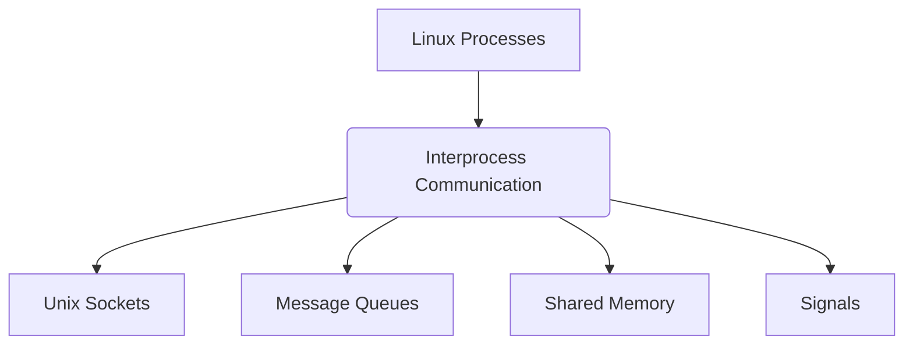

# Interprocess Communication (IPC) in Linux

## Introduction

**Interprocess Communication (IPC)** refers to the mechanisms and techniques provided by an operating system (like Linux) that allow different processes to manage shared data, communicate, and synchronize their actions.

### Key Questions Addressed
* **What is IPC?** Mechanisms enabling process-to-process communication.
* **Why do we need IPC?** To allow isolated processes to exchange information, synchronize tasks, and work collaboratively.

---

## Linux IPC Techniques

This course covers four primary techniques for carrying out interprocess communication on a Linux platform:

1. **Unix Sockets:** For bidirectional communication, often used both locally and over networks.
2. **Message Queues:** Allows processes to exchange data in the form of messages.
3. **Shared Memory:** The most efficient IPC mechanism where multiple processes can access the same memory segment.
4. **Signals:** Used for asynchronous event notification between processes.

### Overview Diagram

---

## Course Structure & Methodology

1. **Theory & Concepts:** Understanding the fundamental mechanisms of each IPC technique.
2. **Demonstration:** Practical implementation walkthroughs for each technique.
3. **Coding Examples:** Hands-on **C programming** examples to demonstrate how to implement these IPC mechanisms programmatically.
4. **Design Discussions:**
    * Exploring how to design applications to efficiently make use of IPC.
    * Architectural best practices.
5. **Final Project:** A comprehensive project providing an opportunity to apply all learned IPC concepts in a practical, real-world scenario.
