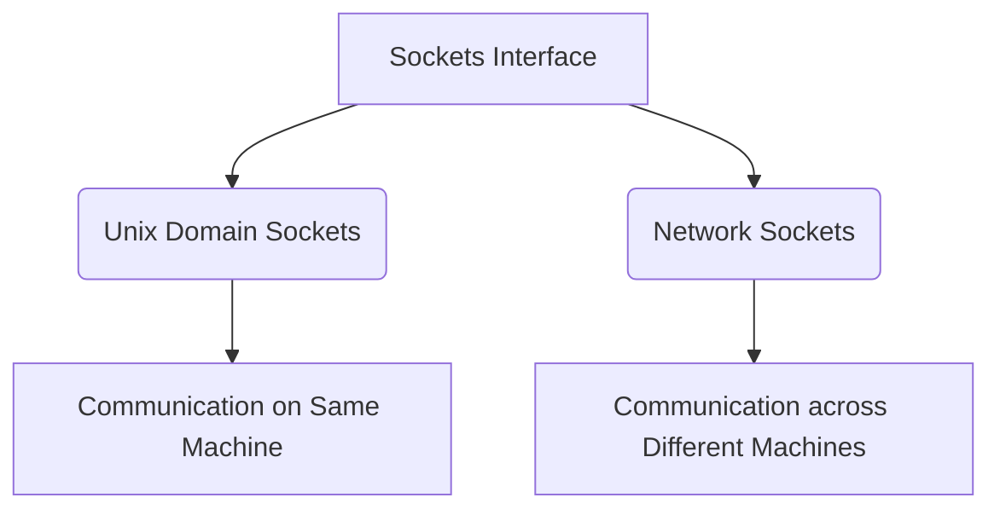
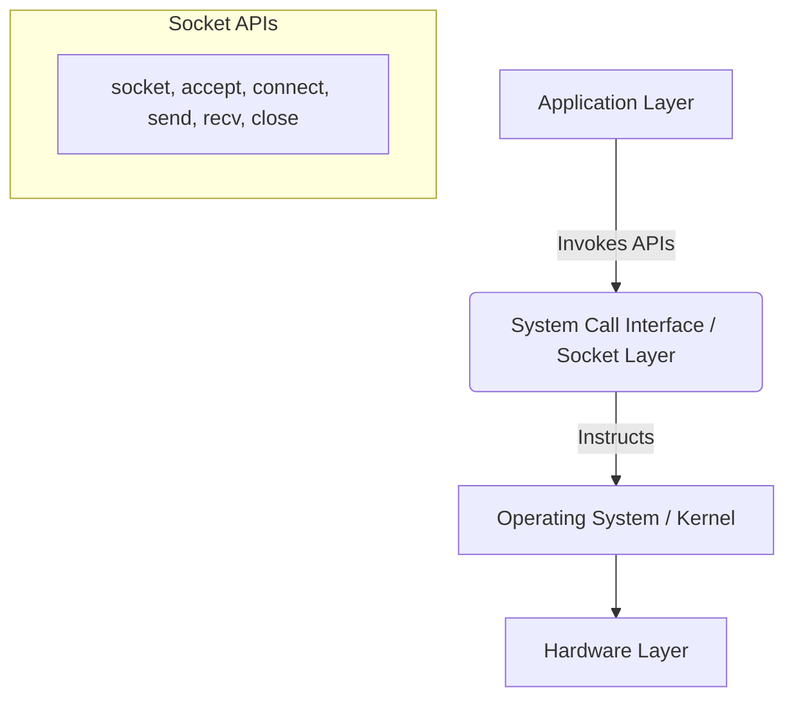
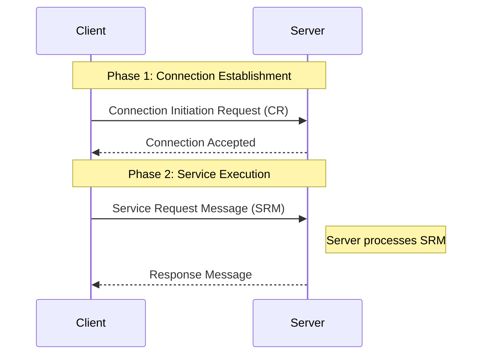
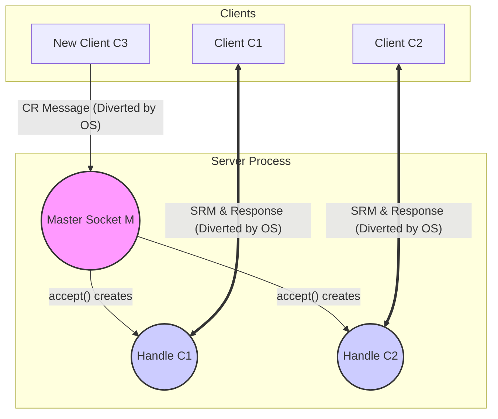
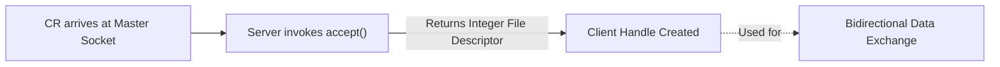

# Introduction to Sockets

## What are Sockets?

**Sockets** provide a generic mechanism for processes to communicate with each other. This inter-process communication (IPC) can happen between:
1. Processes running on the **same machine**.
2. Processes running on **different physical machines** communicating over a network.

The **Socket Interface** is a collection of programming APIs (functions) provided by Unix/Linux-like operating systems. Developers use these APIs to implement socket-based communication in their applications.

---

## Types of Sockets

While the socket interface can implement various types of communication, this course focuses on two primary types:

1. **Unix Domain Sockets:** Used to carry out communication between processes that are running on the *same system or machine*.
2. **Network Sockets:** Used to carry out communication between processes that are running on *different physical machines* deployed over a network.

---

## How Sockets Work: The System Call Interface

To implement a socket-based communication state machine, developers follow a specific sequence of steps using **Socket System Calls**. These are specialized APIs, such as `socket`, `accept`, `connect`, `sendto`, `recvfrom`, `close`, and `select`.

### Socket Programming Steps

Below is the general flow to implement socket communication:

1. Remove the socket, if it already exists.
2. Create a Unix socket using `socket()`.
3. Specify the socket name.
4. Bind the socket using `bind()`.
5. Listen for incoming connections using `listen()`.
6. Accept a connection using `accept()`.
7. Read the data received on the socket using `recvfrom()`.
8. Send back the result using `sendto()`.
9. `close()` the data socket.
10. `close()` the connection socket.
11. Remove the socket.
12. Exit.

### Sockets in Computer Architecture

To understand how socket APIs function, it is essential to see where they fit within a computer's architecture:

### What is a System Call?

* A **System Call** is an API provided by the Linux operating system.
* **Purpose:** Applications invoke these system calls to interact with and request a service from the underlying operating system. 
* **Relationship:** The application acts as the master, instructing the operating system (the slave) to provide a service using these interface APIs.

**Analogy:** 
Even if you haven't written network code before, you have likely used system calls. For example, in C programming, `malloc` and `free` are system calls. When a program calls `malloc`, the application is asking the OS for a chunk of memory. Similarly, invoking socket APIs requests communication services from the OS.

---

## Socket Message Types

In socket-based communication, messages exchanged between the client and server processes are broadly classified into two types:

### 1. Connection Initiation Request (CR) Message
* **Generated by:** The Client process.
* **Sent to:** The Server process.
* **Purpose:** To request the server to accept and establish a dedicated connection. 
* **Note:** This is the very first step. A client cannot request any actual service until this connection is established.

### 2. Service Request Message (SRM)
* **Generated by:** The Client process.
* **Sent to:** The Server process.
* **Purpose:** To request a specific service or data processing from the server (e.g., providing data to be processed).
* **Condition:** Can **only** be sent *after* the connection (via the CR message) has been fully established.

**Example:**
Suppose a client needs to multiply two numbers (A and B), but lacks the capability. The server provides a multiplication service. 
1. The client first sends a **CR message** to establish a connection.
2. Once connected, the client sends an **SRM** containing the numbers A and B.
3. The server processes this SRM (computes A * B) and sends a **Response Message** (the result) back to the client.

*The server identifies and processes CR messages and SRMs very differently.*

### Message Flow Diagram

---

## The Client-Server State Machine

Understanding the state machine of socket-based communication is crucial for visualizing the client-server design and writing socket programming code.

### 1. Server Boot Up & Master Socket Creation
* When the server process starts, the very first thing it does is create a **Connection Socket**, also known as the **Master Socket File Descriptor (M)**.
* This is achieved using the `socket()` system call.
* **Important:** The Master Socket is *only* used to receive new Connection Initiation Requests (CR) from new clients. It is never used for actual data exchange.

### 2. Handling New Connections (`accept()` System Call)
* When a client (e.g., Client C1) sends a new CR message, the server's Operating System (OS) diverts this request directly to the Master Socket.
* The server then invokes the `accept()` system call, passing the Master Socket as an argument.
* **The `accept()` system call has two main goals:**
  1. To complete the connection establishment process with the client.
  2. To create a temporary **Client Handle** (also called a Data Socket or Communication File Descriptor) specifically dedicated to carrying out future data exchange with that client.

*In Linux terminology, both the Master Socket and these Client Handles are simply represented as positive integer numbers known as File Descriptors (e.g., Master Socket could be 9, Client Handle C1 could be 6).*

### 3. Data Exchange and Diversion by the OS
* As more clients (e.g., C2, C3) connect, the Master Socket spawns a new, unique Client Handle for each one. The server maintains a database (like an array, linked list, or tree) of these active client handles.
* Once a connection is established, the client can send a **Service Request Message (SRM)**. 
* **The OS Diversion Role:** When an SRM arrives from a connected client, the OS does *not* send it to the Master Socket. Instead, it intelligently **diverts** the SRM to the specific Client Handle associated with that client. The server processes the request and sends the response back via that same handle.

### Conceptual Diagram

---

## Deep Dive into the `accept()` System Call

The `accept()` system call plays a vital role in socket programming, acting as the bridge to establish duplex (bidirectional) communication between the client and server processes.

### 1. The Trigger
* The process begins when the server receives a **Connection Initiation Request (CR)** message from a new client.
* The OS ensures this CR message always arrives at the server's **Master Socket File Descriptor**.
* The arrival of this message *activates* the master socket.

### 2. Invocation and Output
* Upon activation of the master socket, the server process invokes the `accept()` system call.
* **Return Value:** The primary purpose of calling `accept()` is its return value. It successfully establishes the connection and returns a new **Client Handle** (also known as a Communication File Descriptor).
* Like the Master Socket, this handle is strictly an integer value (e.g., 6, 7, 8).

### 3. Duplex Communication
* Once the `accept()` call returns the Client Handle, the server relies entirely on this handle for all subsequent interactions with that specific client.
* The handle allows for **bidirectional data exchange**—meaning the server uses it both to send data (responses) to the client and to receive data (SRMs) from the client.

### 4. Important Constraint: Connection-Oriented Only
* The `accept()` system call is **exclusive to Connection-Oriented Communication**.
* If a client and server are communicating using a *Connectionless Communication* protocol, the `accept()` system call is **not used**.

