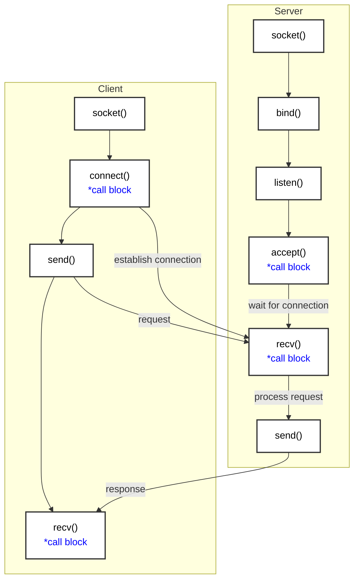
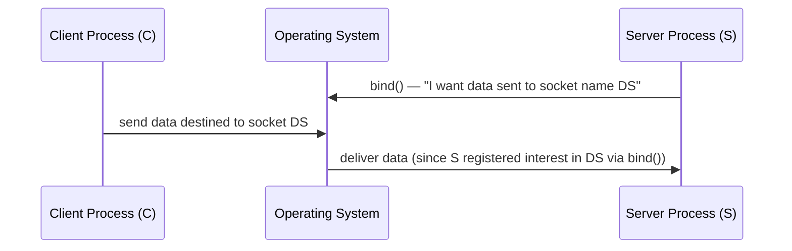
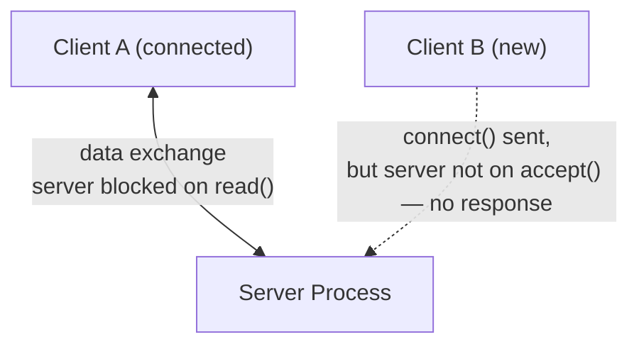

# Unix Domain Sockets

## Overview
**Unix Domain Sockets** are a method of establishing Interprocess Communication (IPC) specifically between two processes that are running on the **same machine**. Whenever the term "IPC" is used, it by default implies communication between processes on the same system.

### The Client-Server Model
The communicating processes in Unix Domain Sockets are always classified into two roles:
*   **Server Process:** The process that waits for requests from clients, processes the requests, and sends the results back.
*   **Client Process:** The process that initiates the communication and sends computation or service requests to the server.

---

## Types of Communication

Using Unix Domain Sockets, you can set up two primary types of communication:

### 1. Stream-Based Communication
*   **Concept:** Involves a continuous exchange of data in the form of a byte stream.
*   **Analogy:** Analogous to the continuous, unbroken flow of water in a stream.
*   **Use Case:** Ideal for transferring large amounts of data seamlessly, such as copying a large movie file from one location on a hard drive to another.

### 2. Datagram-Based Communication
*   **Concept:** Data is moved in small, individual, and discrete units (chunks) called datagrams. There is absolutely no continuous flow of bytes.
*   **Use Case:** Suitable when small, independent messages need to be moved from one process to another.

---

## Source Code

The server process is implemented in **[`server.c`](code/Unix/server.c)**, located inside a `Unix` directory alongside the client implementation, **[`client.c`](code/Unix/client.c)**.

This section discusses `server.c`, which implements the server state machine for Unix domain sockets.

---

## Server Implementation Steps

To implement a Unix Domain Socket on the server side, a specific sequence of system calls must be followed.

1.  **`socket()`:** The server process creates a socket, establishing the master socket file descriptor (connection socket).
2.  **`bind()`:** Binds the created socket to a specific address or socket name.
3.  **`listen()`:** Marks the socket as a passive socket that will listen for incoming connection requests.
4.  **`accept()`:** The server calls this to wait (block) for a connection request from a new client.
5.  **`connect()` (Client Side):** When a client initiates a connection using the `connect()` system call, the server's `accept()` call is unblocked.
6.  **Data Exchange:** Following a successful `accept()`, the server and client process can actively engage in bidirectional communication and data exchange.

### Connection Establishment Flow



---

## Server Process Implementation (Code Walkthrough)

To implement a Unix Domain Socket server (`server.c`), we follow the typical flowchart steps discussed earlier. 

### 1. Example Application Functionality
Before diving into the code, let's understand the specific functionality this example server implements:
* The server takes integer values sent by a connected client and calculates their **running summation**.
* It does not immediately respond back after every value. It keeps adding them up locally.
* **The Exit Condition:** When the client sends the special value `0`, it serves as a signal requesting the final summation.
* The server then returns the accumulated result back to the client, closes the connection with that client, and readies itself to accept new sets of values from a new client.

**Walkthrough Example:**
Suppose a client `C1` communicates with the server:
1. `C1` sends the value `6` → server adds it to its local variable `result` (`result = 6`).
2. `C1` sends the value `7` → `result` is updated to `6 + 7`.
3. `C1` continues sending `8`, `9`, `10`, and so on → the server keeps adding each value to `result`. The server does not respond back to the client during this process.
4. `C1` sends the special value `0` → this signals the server that the client is now requesting the result computed so far.
5. The server returns the result, which is `40`, back to the client.
6. The server then closes the connection with `C1` and is ready to accept a new set of values from some new client.

### 2. Code Implementation Steps

#### Setup and Macros
* Include standard header files.
* Define a constant/macro for the **Socket Name** (this string must be unique within the system).
* Define a constant for the **Buffer Size** (e.g., `128` bytes), which will be used to allocate memory to send and receive data.

See [server.c:8-9](code/Unix/server.c#L8-L9).

#### The Socket Address Structure (`struct sockaddr_un`)
To identify and configure Unix Domain Sockets, standard C APIs provide a specific structure:
```c
struct sockaddr_un name;
```
This structure has two primary members:
1. **Family (`sun_family`):** Defines the address family. For Unix Domain Sockets, this must always be set to the constant `AF_UNIX`.
2. **Name (`sun_path`):** Holds the unique string name of the Unix domain socket.

See [server.c:14](code/Unix/server.c#L14).

#### Unlinking / Destroying Existing Sockets
* **Precaution:** Because you cannot create two Unix domain sockets with the exact same name on the same machine, a best practice is to always attempt to destroy/unlink the socket name before creating it. 
* This prevents errors in case a previous instance of the server process crashed or left the socket hanging in the system. By doing this, the new server process successfully takes ownership of the socket name.

See [server.c:34](code/Unix/server.c#L34).

#### Step 1: Creating the Master Socket (`socket()`)
```c
connection_socket = socket(AF_UNIX, SOCK_STREAM, 0);
```
* **Argument 1 (Family):** `AF_UNIX` explicitly specifies it is a Unix domain socket.
* **Argument 2 (Type):** `SOCK_STREAM` specifies that we want to create a **Stream-based** communication socket. (If we wanted Datagram-based, we would use `SOCK_DGRAM`).
* **Argument 3 (Protocol):** Can be passed as `0` or `NULL` for default behavior.
* **Error Handling:** If the socket system call fails, it returns `-1`.

See [server.c:39-44](code/Unix/server.c#L39-L44).

#### Step 2: Preparing for `bind()`
Before calling the `bind()` system call, the `struct sockaddr_un` variable (`name`) must be initialized:
1. Set the family: `name.sun_family = AF_UNIX;`
2. Copy the socket name string macro into the structure using `strncpy` or `strcpy`.

See [server.c:49-53](code/Unix/server.c#L49-L53).

#### Step 3: The `bind()` System Call

Once `name` (the `struct sockaddr_un`) has been filled with the identity of the Unix domain socket (the address family `AF_UNIX` and the socket name), the next step is to call `bind()`.

**Purpose of `bind()`:** The application (the server process) uses `bind()` to dictate to the underlying operating system the *criteria for receiving data*. In other words, the server tells the OS: "if a sender process sends data destined to the socket with the name `/tmp/DemoSocket`, then such data needs to be delivered to this server process."

* The server process (S) and the client process (C) both run on the same machine, on top of the same operating system.
* Using `bind()`, the server S tells the OS that it is interested in receiving packets addressed to the socket name `/tmp/DemoSocket` (DS).
* When client C sends data to the Unix domain socket, C must specify the name of the socket (DS) in order to send the data.
* Because the OS knows (via `bind()`) that S is interested in data sent to DS, the OS redirects the client's data to server process S.



**Synopsis of `bind()`:**
1. **Argument 1:** The master socket file descriptor (created in Step 1).
2. **Argument 2:** A pointer to the structure (`name`) already filled with the identity/credentials of the Unix domain socket.
3. **Argument 3:** The size of the structure passed as argument 2.

* **Error Handling:** If `bind()` returns `-1`, it means the bind system call has failed.

See [server.c:60-68](code/Unix/server.c#L60-L68).

#### Step 4: The `listen()` System Call

The next step after `bind()` is the `listen()` system call.

* **Argument 1:** The master socket file descriptor (already created).
* **Argument 2:** A numeric value representing the maximum queue size.
  * For example, if this value is `20` and 20 clients send data to the server at the same time, the OS will queue those requests and deliver them to the server one by one for processing.
  * If more than 20 client requests arrive, the OS will drop the requests from the extra clients.
* **Error Handling:** If `listen()` fails, it returns `-1`, and the server exits.

See [server.c:75-79](code/Unix/server.c#L75-L79).

#### Step 5: Entering the Infinite Loop & the `accept()` System Call

* Before calling `accept()`, the server enters an **infinite loop**, because server processes usually run 24×7 — good servers should always be up and running and should never go down. (Have you ever seen Facebook or Google fail to load because their servers are down? No.) It is common practice for server logic to be encapsulated inside an infinite loop.
* Once inside the infinite loop, the server prints that it is waiting on the `accept()` system call.

**Synopsis of `accept()`:**
1. **Argument 1:** The master socket file descriptor (also called the connection socket).
2. **Arguments 2 & 3:** For Unix domain sockets, simply pass `NULL, NULL` (their discussion is not relevant for this course).
* **Return Value:** A **communication file descriptor** (or **data socket**), which the server will use to exchange data with the client for the rest of the connection's lifetime.

**`accept()` is a Blocking System Call:**
* The moment the server invokes `accept()`, its execution gets blocked — it will not proceed to the next line.
* It stays blocked until the server receives a connection initiation request from a client.
* By invoking `accept()`, the server is waiting for some client to connect.
* The moment a client sends a connection initiation request, `accept()` returns, yielding the data socket used to communicate with that newly connected client.
* Once the client is connected, the server prints that the connection has been accepted from the client.

See [server.c:85-97](code/Unix/server.c#L85-L97).

#### Step 6: Receiving and Summing Data (`read()` Loop)

Recall the server's functionality: it keeps summing the non-zero values sent by the connected client. For this, the server enters another (inner) infinite loop, because it must keep accepting and processing integer values until the client sends `0`.

* The server needs memory to receive data from the client — this is the `buffer`. Using `memset`, the server clears any garbage value left in the buffer.
* The server then invokes the `read()` system call.

**Synopsis of `read()`:**
1. **Argument 1:** The communication file descriptor (the data socket). The master socket's job was over at `accept()` — master sockets are only used to accept and create new connections, whereas actual data exchange happens on the data socket returned by `accept()`.
2. **Argument 2:** The buffer to receive data into.
3. **Argument 3:** The size of the buffer.
* **Return Value:** The number of bytes read/received. If negative, an error has occurred and the server terminates.

**`read()` is also a Blocking System Call:**
* Execution halts at this line and stays blocked until the connected client sends some data.
* The moment the client sends data, the server reads it into the buffer, `read()` unblocks, and execution proceeds.

**Processing the Received Value:**
* The server expects only integer values from the client, so it copies only `sizeof(int)` (4 bytes) from the buffer into an integer variable, `data`.
* **If `data == 0`:** the server `break`s out of the inner infinite loop.
* **If `data` is non-zero:** the server adds it to `result` (running summation), then iterates the inner loop again — preparing the buffer and blocking on `read()` once more, waiting for the next data item.
* This continues until the client sends the value `0`.

See [server.c:99-120](code/Unix/server.c#L99-L120).

#### Step 7: Sending the Result and Closing the Connection

Once the client sends `0`, the server breaks out of the inner loop and proceeds to send back the result — the summation of all values computed so far.

* Using `sprintf`, the server prepares a formatted string containing the result.
* The server then sends this result back to the client using the `write()` system call.
  * **Note:** Unlike `read()`, the `write()` system call is **non-blocking** — it executes immediately and does not block for any reason.
  * The synopsis of `write()` is otherwise identical to that of `read()`.
* After successfully sending the result, the server **closes the connection** with that client.
* The server is now done with this client and ready to entertain a new one — it iterates the **outer** infinite loop once again, invoking `accept()` (a blocking call) and waiting for a new connection request from a new client.

See [server.c:122-135](code/Unix/server.c#L122-L135).

> This explains the entire state machine of the server process. You are encouraged to type out these lines on your own machine (rather than copy-pasting) and understand the logic and synopsis of the different system calls used, to get a fair idea of how to implement a Unix domain server process.

Next, we will discuss the steps required to implement the client process — note that the client implementation is much simpler and more straightforward.

---

## Client Process Implementation (Code Walkthrough)

### 1. Client State Machine Overview

The client state machine is pretty much very simple:
1. As soon as the client process starts up, the first thing it does is create a socket file descriptor using the `socket()` system call.
   * There is no concept of a **master socket file descriptor** on the client side — the client creates only a communication file descriptor, and it uses this same file descriptor to carry out all data exchange with the server.
2. Once the client has created the socket, it simply sends a connection initiation request to the server using the `connect()` system call.
   * Once `connect()` succeeds, the client can carry out actual data exchange with the server.

The client-side implementation is in **[`client.c`](code/Unix/client.c)**.

#### Setup and Macros
* The socket name defined in `client.c` is the **same** socket name used while creating the server process — the client uses this name to send data to that socket.
* The client also needs a memory buffer to send data to the server and to receive the result from the server.

See [client.c:9-10](code/Unix/client.c#L9-L10).

### 2. Code Implementation Steps

#### Step 1: Creating the Socket (`socket()`)
* The client creates a Unix domain socket in the same way the server does.
* **Difference:** On the client side, the socket file descriptor returned by `socket()` is itself a **data socket**, not a connection/master socket. There is no concept of a master socket file descriptor on the client side — the socket returned is a communication file descriptor, and the client uses this data socket to carry out actual data exchange with the server.

```c
data_socket = socket(AF_UNIX, SOCK_STREAM, 0);
```

See [client.c:23-28](code/Unix/client.c#L23-L28).

#### Step 2: Populating the `struct sockaddr_un`
* Just as the server does, the client populates a `struct sockaddr_un` (`addr`), specifying the identity of the Unix domain socket to which it wants to communicate:
  1. **Family:** `addr.sun_family = AF_UNIX;`
  2. **Name:** The socket name using which the client will send data to the server.
* This tells the client process which server it wants to communicate with.

See [client.c:36](code/Unix/client.c#L36) and [client.c:40-41](code/Unix/client.c#L40-L41).

#### Step 3: The `connect()` System Call
* The client sends the connection initiation request to the server using the `connect()` system call.

**Synopsis of `connect()`:**
1. **Argument 1:** The data socket (returned by `socket()`).
2. **Argument 2:** A pointer to the structure storing the information of the server socket to which the client wants to send data.
3. **Argument 3:** The size of this structure type.

* **`connect()` is NOT a blocking system call:** If there is no server running, `connect()` returns `-1` immediately.

See [client.c:43-49](code/Unix/client.c#L43-L49).

#### Step 4: Sending Integer Values (Loop)
Recall the client's functionality: it continues to send integer values to the server. The client enters a loop where:
1. It prompts the user to enter an integer value.
2. As soon as the user enters the value, the client sends it to the server using the `write()` system call.

**Synopsis of `write()`:**
1. **Argument 1:** The data socket file descriptor.
2. **Argument 2:** A pointer to the buffer that stores the data to be sent — since the client sends only a single integer value at a time, the address of the integer variable itself is passed directly.
3. **Argument 3:** The size of the data being sent.

* When the user enters the value `0`, the client sends that value to the server, and the loop terminates (since the value of `i` is `0`).

See [client.c:52-61](code/Unix/client.c#L52-L61).

#### Step 5: Receiving the Result (`read()`)
* The client executes this step only after the user has entered the value `0` (and it has been sent to the server) — it is now time to receive the result from the server.
* The client invokes the `read()` system call.
  * **`read()` is a blocking system call:** The client process gets blocked and stays blocked until it receives a reply from the server.
* Once the result is received, the client simply prints the result/message as received from the server.
* The client then closes the connection with the server and exits.

See [client.c:77-93](code/Unix/client.c#L77-L93).

> The state machine of the client process is pretty much very straightforward and simple.

### 3. Client-Specific System Call

* **`connect()`** is invoked only on the client side, and it is used to send the connection initiation request message to the server.
* The client must know the identity of the server with which it wants to communicate — this is why the client process knows the name of the socket (the identity of the server's Unix domain socket), since the second argument passed to `connect()` is the name of the Unix domain socket created by the server. The client must know this name in order to establish communication with the server process.

See [client.c:40-41](code/Unix/client.c#L40-L41).

---

## Demonstration: Running the Server and Client

### Compiling and Running
* Compile the server: `gcc -g server.c -o server`, then execute the resulting `server` executable.
  * On startup, the server creates the master socket file descriptor, successfully invokes `bind()`, and then waits (blocks) on `accept()`.
* Compile the client: `gcc -g client.c -o client`, then execute the resulting `client` executable.

### Observed Behavior
* The moment the client executable runs, it creates its communication file descriptor (data socket) and immediately sends the connection initiation request to the server via `connect()`.
* The server accepts the connection from the client and moves into the data exchange (data communication) phase — it is no longer blocked on `accept()`.
* The client prompts the user to enter an integer value (e.g., `1`); the server accepts this value and waits for the next data item.
* The client sends further values (e.g., `2`, `3`, `4`, `5`); the server accepts each and internally computes the running summation — but does **not** send back a result until the client sends `0`.
* When the client sends `0`:
  * The client receives the summation of the values it sent and then terminates (it closes the connection after receiving the result).
  * The server sends back the final summation, closes the connection with that client, returns to the outer infinite loop, and blocks itself again on `accept()` — ready for a new client.
* The client executable can be run again and again; each time, the server accepts the new connection and repeats the same cycle.

### Drawback: The Server Can Only Handle One Client at a Time

This client-server design has a flaw: **the server process can entertain only one client at a time.**

**Demonstrating the Drawback:**
1. Start a client — it begins sending data items to the server. At this point, the server is blocked on the `read()` system call, waiting for the next data item from this first client.
2. In a separate window, start a **second** client (executing the same client executable again) — this is equivalent to a new client wanting to connect to the same server.
3. The server does **not** respond to this new client at all. If the new client sends its data items followed by `0`, it receives **no result** from the server.

**Reason:** The server must be blocked on the `accept()` system call in order to establish a connection with a new client. But at this point, the server is not blocked on `accept()` — it is blocked on `read()`, waiting for data from the first client. As long as the server remains in the data exchange state with the first client, no other client in the system can participate in communication with the server.



**In brief:** the server process is able to handle only one client at a time; it cannot handle multiple clients simultaneously. This is the drawback of this server design. A future discussion will improve the server design so that it can handle multiple clients at the same time.

> You are encouraged to download the source code, compile and execute these files on your own machine, and analyze the behavior yourself. Please do not copy-paste the code — write it from scratch, to build genuine understanding and confidence.

---

## Summary of System Calls Used

### Connection Establishment APIs
* **`connect()`** (Client Side) and **`accept()`** (Server Side) are **complementary** to each other.
  * The connection initiation request generated by the client process using `connect()` is processed on the server side by `accept()`.
  * `connect()` is **not** a blocking system call.
  * `accept()` **is** a blocking system call.

### Data Exchange APIs
Once the connection between client and server is fully established, the client sends Service Request Messages (actual data) to the server. In the example discussed, the `write()` system call was used, but Linux also provides equivalent system calls: `sendmsg()` and `sendto()`.

There is a **1-to-1 mapping** between the "send" API used and the corresponding "receive" API to be used on the other side:

| Send API (this side) | Corresponding Receive API (other side) |
|---|---|
| `write()` | `read()` |
| `sendto()` | `recvfrom()` |
| `sendmsg()` | `recvmsg()` |

* If you use `write()`, you should use `read()`.
* If you are using `sendto()`, then you should use `recvfrom()`.
* If you are using `sendmsg()`, then you should use `recvmsg()`.

**Note:** All the system calls intended to receive a message from the other process — `read()`, `recvfrom()`, `recvmsg()` — are **blocking system calls**.

---

## Observations and Next Steps

* We have seen in the demonstration that when the server is servicing the current client, it cannot entertain any new client. This is a **drawback** of the server design discussed so far, and this limitation needs to be alleviated.
* A server can be redesigned to serve multiple clients at the same time using the concept of **multiplexing**.
* Using multiplexing, a server can be redesigned to handle multiple client connections at the same time.

> This will be the topic of the next discussion — the concept of multiplexing.
