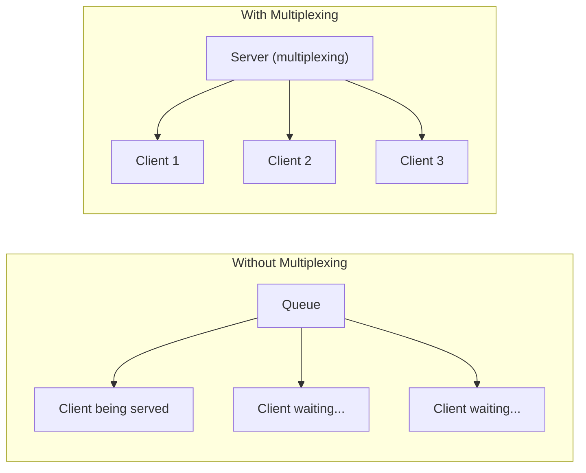
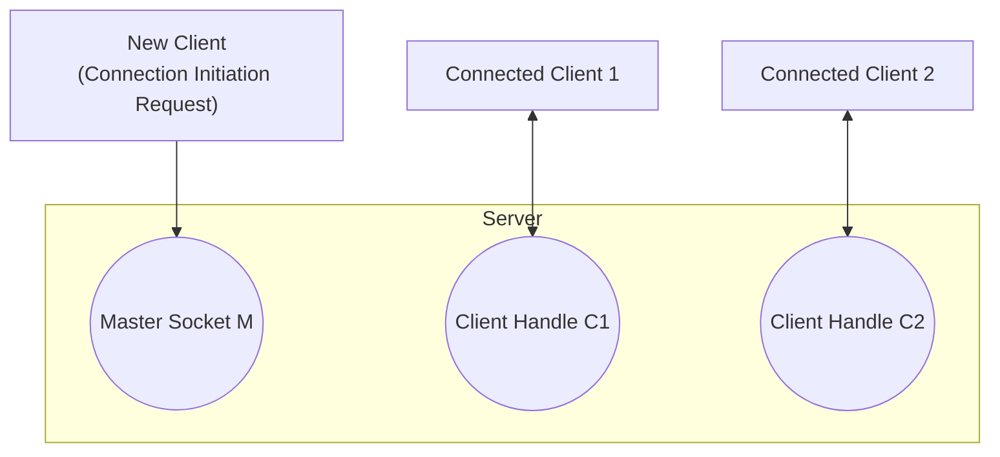
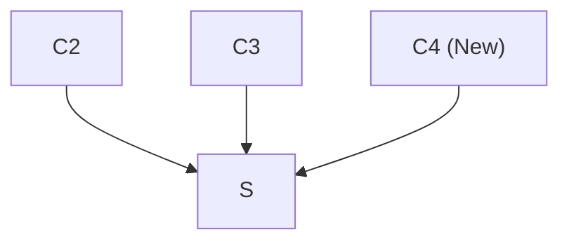
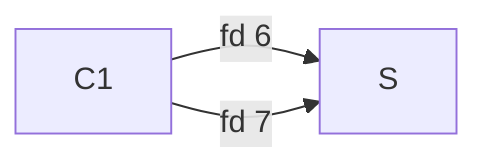
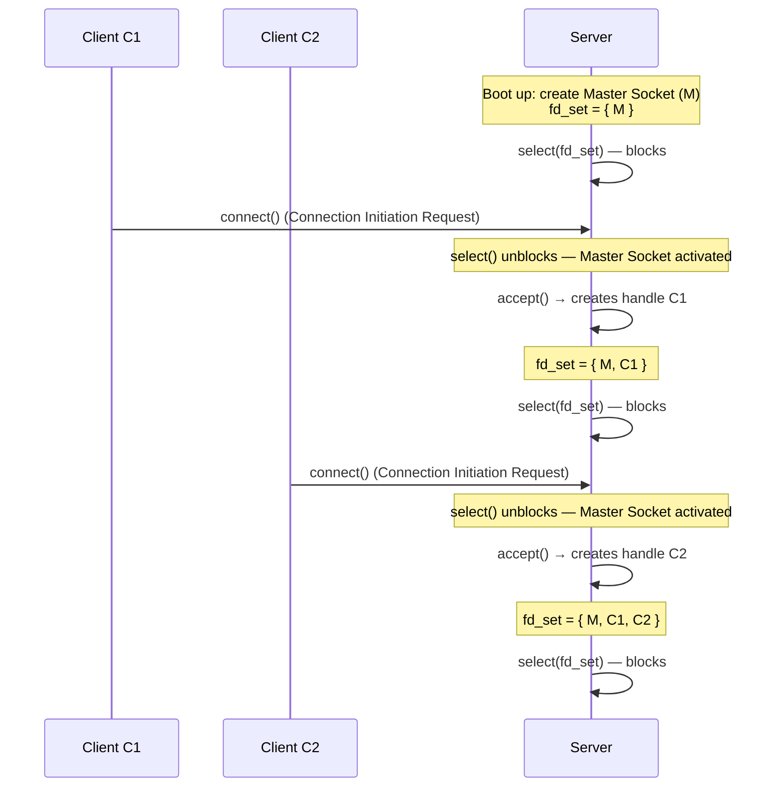
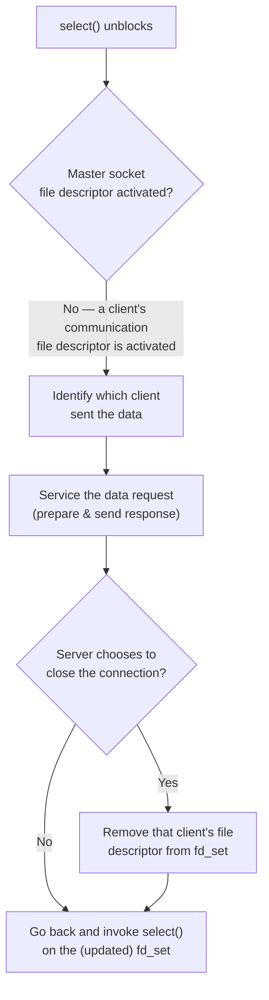

# Multiplexing

## What is Multiplexing?

**Multiplexing** is a mechanism through which the server process can monitor **multiple clients at the same time**.

* Without multiplexing, a server process can entertain only **one client at a time** and cannot entertain other clients' requests until it finishes with the current client.
* This problem was already observed in the previous demonstration of server-client communication: when the server was entertaining/processing the request of one client, it did not respond to the connection initiation request sent by another client.
* A server process should have the capability to handle multiple clients at the same time — this is a huge drawback for a server process to not have.
* The concept of **multiplexing** allows a server to entertain multiple connected clients simultaneously.

---

## The Queue Analogy

The following pictures demonstrate the concept of multiplexing and what happens when you don't have it:

* **Without Multiplexing (Left Picture):** A long queue, where while the person at the front of the queue receives service, all other persons standing behind him have to wait for their turn. Once the person at the front receives the service, if he wishes to receive the same service again, he has to join the queue right from the back.
  * This is equivalent to the situation where, once the current client is serviced by the server, the client has to rejoin the queue from the last — meaning the client has to send a **fresh connection initiation request** to the server to get another service.
* **With Multiplexing (Right Picture):** A person with multiplexing capabilities can do multiple tasks at the same time.
  * A server can service multiple clients at the same time using the concept of multiplexing.



---

## The `select()` System Call

Linux provides a special system call which enables the developer to implement multiplex-based communication: the **`select()`** system call.

* `select()` helps monitor the activity of all clients connected to the server, at the same time.
* Using `select()`, the server can monitor the state of all connected clients simultaneously — i.e., which client has sent data, which client has not sent data, and which client has sent a new connection initiation request.

---

## Server File Descriptor Management

* The server process has to maintain **client handles**, also called **communication file descriptors**, to carry out communication with each connected client.
* In addition, the server process has to maintain the **connection socket** or **master socket file descriptor** (M), whose purpose is to process new connection initiation requests from new clients.

**Example:** At a given point in time, suppose two clients are connected to the server. The server is then maintaining **three** file descriptors in total:
1. The master socket file descriptor, **M**.
2. Communication file descriptor **C1** (for the first connected client).
3. Communication file descriptor **C2** (for the second connected client).



---

## The `FD_SET` Data Structure

* Linux provides an inbuilt data structure to maintain the set of socket file descriptors, making their maintenance easy. This data structure is called **`fd_set`** — the **File Descriptor Set**.
* `fd_set` is a standard data structure provided by the API — it is a set of file descriptors maintained by the server at any point in time.
* The **`select()`** system call monitors all the socket file descriptors present in this `fd_set` data structure.
* In other words, `select()` operates on a set of file descriptors maintained by the server — the argument passed to `select()` is the `fd_set` data structure containing this set of file descriptors.

---

## `select()` System Call — Detailed Discussion

* `select()` allows the server machine to **MONITOR** multiple client connected connections and check which client has sent data to process.
  * *Analogy:* Just like a class monitor keeps an eye on all the students of the class at the same time.



### `select()` is a Blocking System Call
* Meaning: when it is executed, the code execution halts (similar to `scanf`/`getch`).

### When Does `select()` Unblock?
`select()` unblocks when either of two things happen on the server side:
1. A **new connection request** from a new client arrives.
2. A **data request** from an existing connected client arrives.

### After `select()` Unblocks
* The server needs to check whether it's a new connection request **or** a new data request on an existing connection.
* In the latter case, the server needs to find **which client** has sent the data.

### Master Socket and Client Handles
* When the server starts, the first thing it does is create a **master socket** — a socket to detect the arrival of a new connection request from a new client.
* This master socket, once created, gives birth to the rest of the communication file descriptors for clients.

---

## The `fd_set` Data Structure

* C provides a data structure called **`fd_set`**, which is a collection (or a set) of file descriptors.

```c
fd_set readfds;
```
* `fd_set` — the **data type**.
* `readfds` — the **variable** name.

* Conceptually, this set holds the file descriptor numbers being monitored, e.g.:
```
fd_set = { 6, 7, ... }
```



---

## How `select()` and `accept()` Work Together (Multiplex Server Walkthrough)

Having understood the `select()` system call, the `fd_set` data structure, and the `accept()` system call, we can now see how they collaboratively work together to implement a **multiplex server** — a server with the capability to handle multiple client connections at the same time.

### Step 1: Server Boot-Up

When the server process starts, it does three things:
1. Creates a master socket file descriptor.
2. Places that master socket file descriptor into the `fd_set` data structure (denoted `readfds` — referred to as "Read").
3. Invokes the `select()` system call on this `fd_set`.

At this point, the `fd_set` contains only **one** file descriptor — the master socket — whose purpose is to detect new connection initiation requests from a new client. Since `select()` is a blocking system call, the server process is now waiting for a new connection initiation request from a new client.

`fd_set` at this point: `{ Master Socket }`

### Step 2: Client C1 Connects

* Suppose client C1 wants to carry out communication with the server — it sends a connection initiation request by invoking `connect()`.
* As soon as the server detects this, `select()` gets **unblocked**.
* Since the server is unblocked because it received a connection initiation request from a new client, the next step is to invoke `accept()`.
* `accept()` generates a **communication file descriptor** for client C1 — this will be used to carry out actual data exchange with C1 for the rest of the connection's lifetime.
* The server saves this communication file descriptor in the `fd_set` (alongside the master socket file descriptor).
* The server then goes back and invokes `select()` again on the updated `fd_set`.

`fd_set` at this point: `{ Master Socket, C1 }`

### Step 3: Monitoring Two File Descriptors

Now that two file descriptors are being monitored:
* If client C1 (already connected) sends a data request to the server → the **communication file descriptor** for C1 gets activated.
* If a new client sends a new connection initiation request → the **master socket file descriptor** gets activated.

Which file descriptor is activated depends entirely on whether C1 sends a data request, or a new client sends a new connection initiation request.

### Step 4: Client C2 Connects

* Client C2 sends a connection initiation request to the server.
* The server's `select()` unblocks, because the master socket file descriptor is activated.
* The server invokes `accept()` — the return value is again a communication file descriptor, which the server will use to carry out future communication with client C2.
* This new communication file descriptor is added to the `fd_set`.
* The server again invokes `select()` on the updated `fd_set`.

`fd_set` at this point: `{ Master Socket, C1, C2 }`

At this point, the server process is in a state where it can process new connection initiation requests from new clients, as well as data requests from either client C1 or client C2, in any sequence.



`select()` monitors all the file descriptors present in the `fd_set`, and depending on the type of event that takes place (a new connection initiation request, or a data request from an already-connected client), the appropriate file descriptor is activated, and the server gets unblocked from `select()` to process that particular type of request.

---

## Processing a Data Request (Flowchart)

Discussing the same thing with the help of a flowchart — when the server receives a data request from an already-connected client:

1. The server gets unblocked from `select()`.
2. The server checks whether it is the master socket file descriptor which is activated — in this case, it is **not**; it is the **communication file descriptor** which is activated.
3. The next thing the server needs to do is identify **exactly which client** has sent the data (since the server could be connected to many clients).
4. Once the server finds that particular client, it services the data request — it prepares the response and sends it back to that particular client.
5. **If** the server chooses to close the connection with that particular client, it must remove that client's communication file descriptor from the `fd_set` data structure, since there is no need to maintain it if no future communication with that client will occur.
6. The server goes back and again invokes `select()` on the updated `fd_set`.



> The previous diagram and this flowchart together make it very clear regarding how a multiplex server actually works.

---

## Multiplex Server Implementation (Code Walkthrough)

The source code for this new server design (with multiplexing capabilities) is in **[`server.c`](code/Multiplexing/server.c)**, inside the `Multiplexing` directory.

* Since the earlier (non-multiplex) Unix domain server has already been walked through, many implementation steps remain **the same** — there is no difference for those steps.
* However, since this is a multiplex server, there is a design change so that this Unix domain server can handle multiple clients at the same time.

### Setup and Macros
* The Unix domain socket name used is the **same** as before (`/tmp/DemoSocket`), and the buffer size for sending/receiving data is again **128 bytes**.
* Since this server maintains multiple clients at the same time, an upper limit is placed on the number of clients that can be connected simultaneously, via the macro **`MAX_CLIENT_SUPPORTED`** (`32`).
  * The actual maximum number of *clients* is **31** — one less than this macro — because the server also has to maintain one additional file descriptor: the **master socket file descriptor**.

See [server.c:8-11](code/Multiplexing/server.c#L8-L11).

### Global Data: the Monitored FD Set Array
* A global array called **`monitored_fd_set`** is declared — an array of all the file descriptors the server process is maintaining. The master socket FD is also a member of this array.
  * Example: if the server has 3 clients connected at the same time, this array contains 4 file descriptors — the 3 clients' file descriptors, plus the master socket file descriptor.
* A second global array, **`client_result`**, maintains each connected client's intermediate (running summation) result.
* **Server functionality is unchanged:** the server accepts integer values sent by the client, keeps computing the running summation, and sends back the summation when the client sends the value `0`.

See [server.c:13-20](code/Multiplexing/server.c#L13-L20).

### Helper APIs (operating on the Monitored FD Set Array)

* **`intitiaze_monitor_fd_set()`** — Initializes every element of `monitored_fd_set` to `-1`. A value of `-1` represents an empty slot; if all slots are `-1`, the server is not currently maintaining any file descriptors.
* **`add_to_monitored_fd_set(int skt_fd)`** — Takes a file descriptor as an argument, finds an empty slot (`-1`) in the array, and adds the file descriptor there (i.e., adds a new file descriptor to be monitored by the server).
* **`remove_from_monitored_fd_set(int skt_fd)`** — Removes a given file descriptor from `monitored_fd_set` (resets that slot back to `-1`).
* **`refresh_fd_set(fd_set *fd_set_ptr)`** — Takes a pointer to the standard `fd_set` structure (provided by the C library). This function calls `FD_ZERO` to clear the `fd_set`, then re-copies (via `FD_SET`) all the file descriptors currently present in `monitored_fd_set` into it. In other words, it **clones** the file descriptors from the array into the standard `fd_set` structure.
* **`get_max_fd()`** — Returns the numerical maximum value among all the file descriptors the server is maintaining. (E.g., if the server maintains file descriptors `6, 7, 8`, this API returns `8`.)

See [server.c:22-89](code/Multiplexing/server.c#L22-L89).

### Why These APIs Exist
The server process has to maintain the communication file descriptors for all the clients it is communicating with — hence these APIs, which operate on an array that is simply a collection of the file descriptors the server process is maintaining.

---

### Main Function Walkthrough

#### 1. Initialization
* The first thing `main()` does is call `intitiaze_monitor_fd_set()` — this initializes `monitored_fd_set` with `-1`, meaning that when the server boots up, it is not yet maintaining any file descriptor.

See [server.c:113](code/Multiplexing/server.c#L113).

#### 2. Unchanged Steps: Master Socket, `bind()`, `listen()`
* Creating the master socket file descriptor (connection socket), calling `bind()`, and calling `listen()` are all **exactly the same** as in the previous (non-multiplex) server design — these steps remain unchanged.
* Once the master socket file descriptor has been created successfully, the server adds this master socket file descriptor to `monitored_fd_set` (via `add_to_monitored_fd_set()`).

See [server.c:120-168](code/Multiplexing/server.c#L120-L168).

#### 3. Entering the Infinite Loop
The server now enters its infinite loop, and on each iteration:

1. **Refresh the `fd_set`:** The server invokes `refresh_fd_set(&readfds)`, where `readfds` is a variable of type `fd_set`. Because the standard `fd_set` and `monitored_fd_set` must be **clones of each other** before invoking `select()`, this call copies all the file descriptors from the array into `readfds`.
   * This is necessary because the second argument to `select()` must be an `fd_set`, and it must contain all the file descriptors the server is monitoring, including the master socket file descriptor.
2. **Invoke `select()`:**
   * **Argument 1:** The maximum numerical file descriptor present in the `fd_set`, **plus one** (obtained via `get_max_fd()`). *(E.g., if the server monitors file descriptors `6, 7, 8`, argument 1 should be `9`.)*
   * **Arguments 3, 4, 5:** Passed as `NULL`.
   * `select()` is a **blocking** system call — the server process blocks here.
   * At this point (right after boot-up), the `fd_set` contains only the master socket file descriptor, so the server will only unblock when some client sends a connection initiation request.

See [server.c:174-184](code/Multiplexing/server.c#L174-L184).

#### 4. After `select()` Unblocks: Checking for a New Connection
* The server checks whether it is the master socket file descriptor which is activated, using the standard C macro **`FD_ISSET`** (e.g., `FD_ISSET(connection_socket, &readfds)`).
* **If true** (master socket activated — a new client has sent a connection initiation request):
  1. Print that a new connection has been received.
  2. Call `accept()` to accept the connection — the return value is a communication file descriptor (data socket), i.e., the client handle.
  3. Add this new data socket to `monitored_fd_set` via `add_to_monitored_fd_set()`, so that the **next** invocation of `select()` also monitors this new client handle.
  4. The loop continues — the server goes back to `refresh_fd_set()` and `select()` again, this time with the `fd_set` containing the master socket **and** the new client's communication file descriptor.

See [server.c:186-201](code/Multiplexing/server.c#L186-L201).

#### 5. Handling a Data Request
* **If the master socket is *not* activated**, it means some other file descriptor present in the `fd_set` has been activated — i.e., an already-connected client has sent a data request.
* The server loops over the entire `monitored_fd_set` array, testing (via `FD_ISSET`) whether each element has been activated, to find **exactly which** client sent the data.
* Once the activated client handle is found:
  1. The server reads the data sent by this client using `read()` (the server expects an integer value).
  2. **If the value is `0`:** the server sends back the result to the client using `write()` (the buffer holds that client's computed summation, read from `client_result[i]`). After sending the result, the server closes the connection with that client, resets `client_result[i]` to `0`, and removes the client's handle from `monitored_fd_set` (via `remove_from_monitored_fd_set()`) — since the server is now done with this client and need not maintain its handle in future invocations of `select()`.
  3. **If the value is non-zero:** the server simply adds this value to `client_result[i]` (the running summation for that client), then goes back and blocks on `select()` again — waiting either for a new connection initiation request or new data from any connected client.

See [server.c:207-252](code/Multiplexing/server.c#L207-L252).

> This is the implementation of the entire state machine of a server with multiplexing capabilities — i.e., a server that can entertain/process multiple clients' requests at the same time.

### Note: Console Input (fd 0) in the Actual Code
The actual `server.c` also adds file descriptor `0` (standard input) to `monitored_fd_set` at startup, and has a dedicated branch that checks `FD_ISSET(0, &readfds)` — if activated, it reads and prints console input (`"Input read from console : %s\n"`). This lets the server also react to input typed directly into its own terminal, in addition to client master-socket and data-socket activity. See [server.c:114](code/Multiplexing/server.c#L114) and [server.c:202-206](code/Multiplexing/server.c#L202-L206).

---

## Demonstration: Multiple Clients Handled Simultaneously

Four windows are used: one for the server process, and three for separate client processes.

* **Server:** Compile `server.c` and run the executable. The server creates the master socket file descriptor, invokes `bind()` successfully, and is now waiting on `select()`.
* **Client program is unchanged:** the client program used here is exactly the same as previously discussed — no change.

### Connecting Multiple Clients
* **Client 1** is started (second window). The server accepts the connection from this new client, and goes back to waiting on `select()` — ready to accept a connection from another new client, as well as accept a data request from this already-connected client.
* **Client 2** is started (third window). The server accepts the connection from this second client as well — two clients are now connected to the server at the same time.
* **Client 3** is started (fourth window). The server accepts this connection too — three clients are now connected to the server simultaneously.

### Per-Client Summation, in Any Order
The server must be able to compute the summation of the integer values sent by all these clients, in any order, and maintain each client's summation **on a per-client basis**:
* **Client C1** sends `1`, `2`, `3` to the server.
* **Client C2** sends `7`, `8` to the server.
* **Client C3** sends `10`, `20` to the server.

Then, requesting the result from each client:
* C1 sends `0` → expected result `6` → server returns `6`.
* C2 sends `0` → expected result `15` → server returns `15`.
* C3 sends `0` → expected result `30` → server returns `30`.

This confirms the server is able to keep the result of individual connected clients in isolation from each other, across its entire state machine.

### Additional Observations
* The client processes can send their integer values to the server in **any order or sequence**.
* While the server is busy providing services to already-connected clients, a **fourth client** can come up and join the communication by sending a connection initiation request — the server is able to process this new connection request as well, even while it was in the middle of servicing data requests for already-connected clients.

> A complete multiplex server has been implemented, which can handle multiple clients at the same time.
