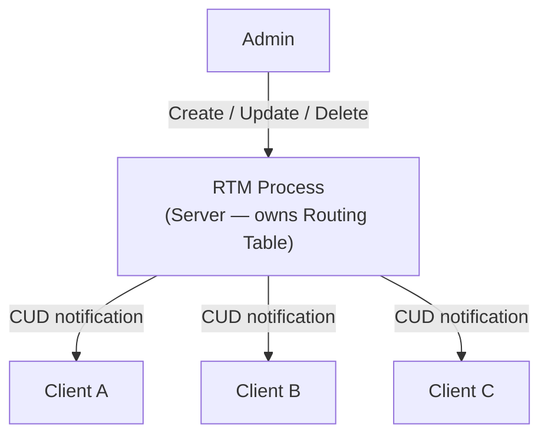
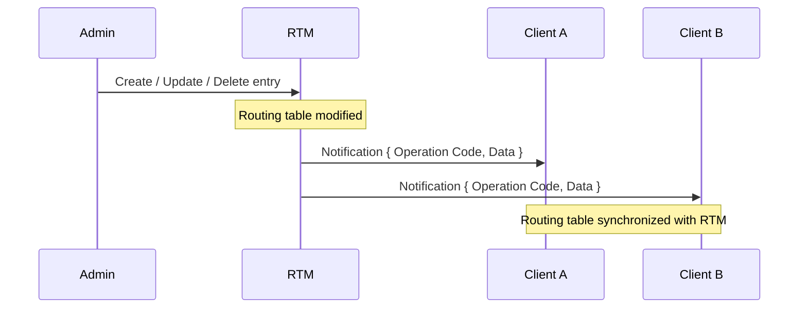

# Project: Data Synchronization (Unix Domain Sockets)

## Project Overview

* **Project name:** Data Synchronization.
* **Goal:** Demonstrate how Inter-process Communication (IPC) can be used to achieve data synchronization between processes running on the same machine.
* The project involves creating a **Routing Table Manager** process, abbreviated as **RTM**.
* RTM is in charge of a **Layer 3 (L3) routing table**.
  * It is RTM's responsibility to maintain the L3 routing table and send notification of any change in the routing table's contents to connected clients.
* **End goal:** The state of the routing table needs to be synchronized across all clients at any point in time — the state of the routing table has to be exactly the same across all connected clients.

---

## The Big Picture

* **RTM** is a special process — it is actually a **server process** — and it is in charge of the routing table.
* Other processes running on the same machine are **client processes**, connected to the RTM process as Unix domain clients.
* Whenever any entry is added, updated, or deleted in the routing table managed by RTM, it is RTM's responsibility to synchronize that same operation to **all** connected clients.
* These operations are abbreviated as **CUD operations**:
  * **C** — Create
  * **U** — Update
  * **D** — Delete
* RTM sends update notifications to all connected clients whenever a CUD operation occurs.



---

## The Routing Table

* The routing table is managed by the **admin** — a person who interacts with the RTM process.
* The admin can choose to **create**, **update**, or **delete** any entry in the routing table managed by RTM.

**Sample Routing Table:**

| Destination Subnet | Gateway IP | Interface |
|---|---|---|
| *(IP address/subnet format)* | *(IP address)* | *(interface name)* |

* You do not need to understand what a routing table entry actually *means* — just that there exists a table consisting of these three fields: destination IP address/subnet, gateway IP address, and outgoing interface.
* For this project, you may also choose to work with any other type of table you feel more comfortable with (a routing table is just the example used here).

---

## Data Structure for the Routing Table

* You are free to choose any data structure to represent the routing table — e.g., a simple **linked list** of routing table entries.
* Each **row** in the routing table is called a **routing table entry**. A linked list of these entries represents the routing table.       

### Operations the Admin Can Perform

1. **Insert:** The admin specifies the three values corresponding to the three fields of the routing table — destination + mask, gateway IP address, and outgoing interface.
2. **Update:** The admin specifies the destination + mask (used as the **key** to search for the entry in the routing table), along with the new gateway IP address and new outgoing interface. Once located, the old gateway IP address and old outgoing interface are overwritten with these new values.
3. **Delete:** The admin specifies only the destination + mask (the key). Once the entry is located using this key, it is simply deleted from the routing table.

> The **destination** and **mask** together form the **key** used to uniquely identify a particular entry in the routing table.

---

## Synchronizing Changes to Clients

Whenever the admin performs an operation on the routing table, the RTM process needs to synchronize that particular operation to all connected clients.

### New Client Connection: The Dump Operation

* Suppose `n` clients are already connected to the RTM process, and a new client connects.
* This new client knows nothing about the current routing table state.
* Once the server receives the connection initiation request from the new client and the connection is fully established, it is RTM's responsibility to send the **entire routing table snapshot** to this newly connected client.
* This is called the **dump operation** (dumping of the routing table).
* At any given point in time, the routing table must be identical on the RTM process as well as on all connected clients.

### Ongoing Synchronization

* Assume all connected clients (e.g., Client A) currently have their routing table in complete synchronization with RTM's routing table.
* Suppose the admin performs an operation on RTM — e.g., adds a new entry to the routing table.
* RTM's responsibility is to synchronize this addition to all connected client processes — it conveys this information using a **notification message** with two fields:
  1. **Operation Code** — denotes whether the entry was created, updated, or deleted.
  2. **Data** — the data that was added/updated/deleted in the routing table.
* When a client process receives this notification from RTM, it processes the update — as a result, the client's routing table becomes synchronized with RTM's routing table.
* Similarly, when the admin updates or deletes an entry on RTM, RTM sends the corresponding operation code (update or delete) along with the data to all other connected clients.



> **End goal:** At any point in time, the state of the routing table across all clients must be exactly the same as the state of the routing table on the RTM process.

---

## Suggested Data Structures

### 1. Operation Code (Enumeration)

Three operation codes are needed — **Create**, **Update**, **Delete**:
* **Create** — corresponds to creating a new entry in RTM's routing table.
* **Update** — corresponds to updating an existing entry in RTM's routing table.
* **Delete** — used when the admin deletes an entry from the routing table.

```c
typedef enum {
    CREATE,
    UPDATE,
    DELETE
} op_code_t;
```

### 2. Routing Table Entry (Structure)

Represents a single entry of the routing table — consists of four pieces of information: **Destination**, **Mask**, **Gateway**, and **Outgoing Interface**.

```c
typedef struct {
    /* Destination + Mask together form the key */
    char destination[...];
    char mask[...];
    char gateway[...];
    char oif[...]; /* outgoing interface */
} routing_table_entry_t;
```

### 3. Notification Message (Structure)

Used by RTM to send a notification to connected clients — a blend of the **Operation Code** and the **Message Body** (the exact data being added/updated/deleted).

```c
typedef struct {
    op_code_t op_code;
    routing_table_entry_t data; /* message body */
} rtm_notification_t;
```

---

## Next Steps

The functionality of this project has now been discussed. When other IPC mechanisms are covered later in the course, this project will be extended with more complexity and functionality.

> Proceed to Module 2 (the next IPC mechanism) only once this project has been completed.

This concludes the discussion of Unix Domain Socket based Inter-process Communication.
