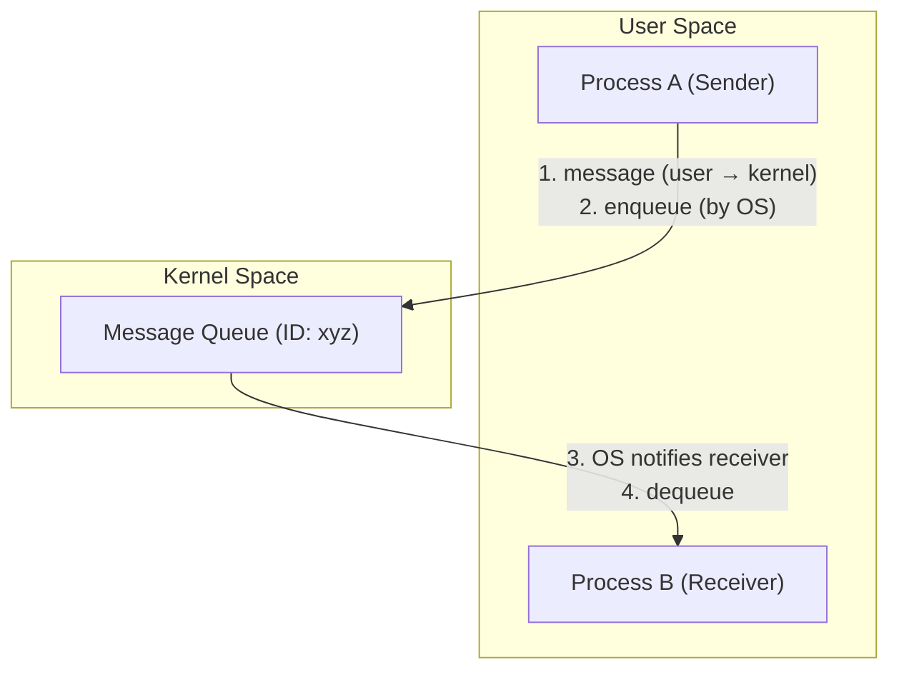
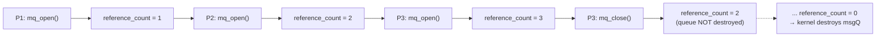
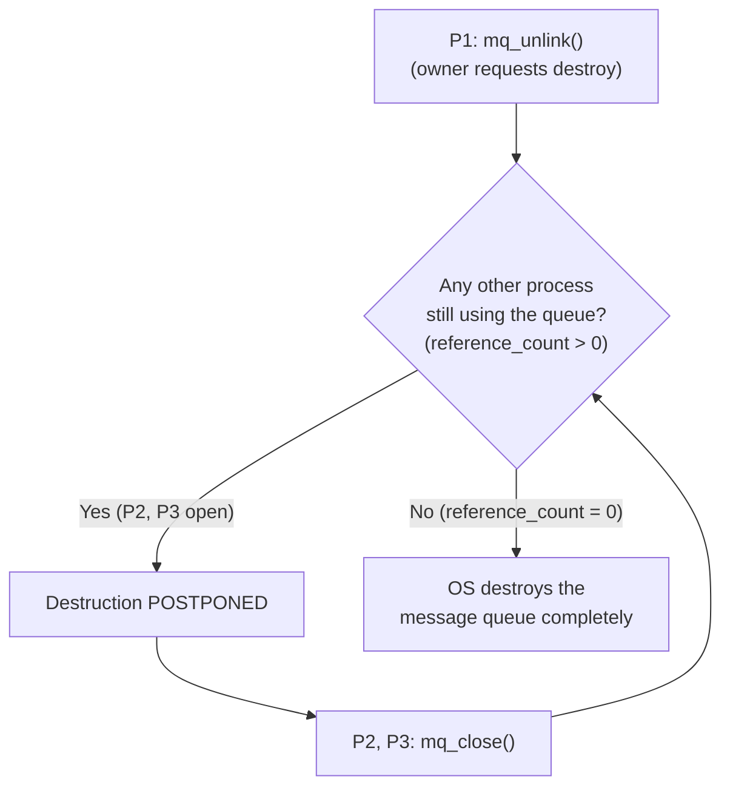
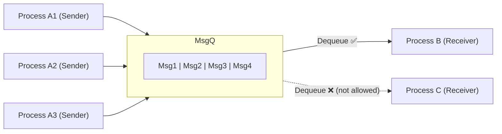
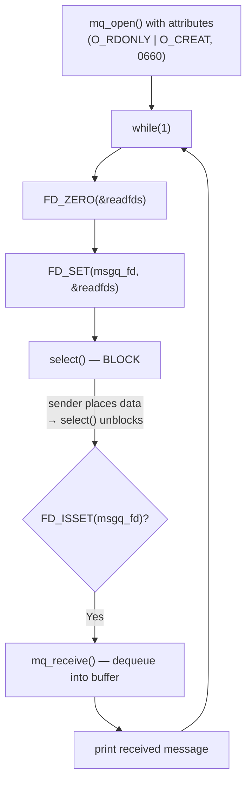

# Message Queue

## Introduction

The next IPC technique to be covered in this module is **Message Queue**.

In this module, the following will be discussed:
1. The concepts of message queue as an IPC mechanism.
2. The APIs provided by the Linux operating system for message queue management.
3. Some design aspects regarding how message queue should be used.
4. A code walkthrough — the steps to implement message queue based inter-process communication between two processes.

---

## How Message Queue Works

The following diagram captures the functioning of a message queue — how it can be used to implement IPC between two processes:

* **Process A** — a **sender** process, running on a Linux machine.
* **Process B** — a **receiver** process, running on the same Linux machine.

Between process A and process B, the channel of communication is a **message queue**.

* Process A (the sender) can **enqueue** the message into the message queue.
* The messages are delivered to process B in the **same sequence** in which they were enqueued by process A.
* The process of removing a message from the message queue at the other end is called **dequeue** of a message, and the dequeue operation is done by the receiver process.


So, message queue is a communication channel between process A and process B.

Linux/Unix based operating systems provide this mechanism — called **message queue** — for carrying out inter-process communication. Processes running on the same machine can exchange any data using message queue.

* Message queue is a mechanism to implement IPC between processes which are running on the **same machine**.
* If the processes are running on different machines, there is no other way other than using **network sockets**.

---

## Key Characteristics of Message Queue

### Creating or Using an Existing Message Queue
* A process can create a new message queue, or can use an existing message queue which was created by another process.
* If the message queue already exists, the process can use the existing message queue to send or receive messages from another process.

### Unique ID
* A message queue is identified by a unique ID, and no two message queues can have the same ID.
* Within a Linux system, each message queue is assigned a unique ID, and this unique ID is actually a string.
* No two message queues in the system can have the same unique ID at the same time.

### Message Queue is a Kernel Resource
* Message queue resides and is managed by the kernel/operating system.
* Kernel resource means a resource which exists inside the operating system, inside the kernel.
* The processes only harness or make use of the message queue which resides in the operating system.
* Message queue is a service provided by the operating system to userspace processes for carrying out data exchange.
* Message queue is just one of the kernel resources — just like memory is one kernel resource, message queue is another kernel resource.

### Data Exchange
* The sending process (A) can post data to the message queue.
* The receiving process (B) reads the data from the message queue.

### Owner / Creator
* The process which creates a new message queue is termed the **owner** or **creator** of the message queue.

---

## User Space and Kernel Space

A system can be logically divided into two parts: the **user space** and the **kernel space**.

* **User space** — the area where all applications run. Any application you run on the operating system actually runs in the user space.
  * Process A (the sending process) and process B (the receiving process) are processes running in the user space.
* **Kernel space** — the area where system/kernel services run. For example, the operating system scheduler, memory manager, device drivers, and many more services of the operating system run in the kernel space.

The message queue created by one of the user space processes is a kernel resource and is created inside the kernel space.

### Creation of the Message Queue
* Suppose process A is the creator of a message queue — process A creates the message queue inside the kernel space.
* Process A has to provide a **message queue ID**. In this example, the message queue ID is taken as `xyz`, which is a string.
* Process A has now created a kernel resource (the message queue), and this message queue exists inside the kernel space.
* This message queue can then be used by the sender process (A) as well as process B for carrying out inter-process communication — process A can enqueue the message to the message queue, and process B can take the message from the message queue.

### Flow of a Message (User Space ↔ Kernel Space)
Any message sent by process A to process B via a message queue goes through the following flow:
1. The message generated by process A goes from **user space to the kernel space**.
2. The message is then **enqueued** in the message queue by the operating system.
3. The operating system **notifies** the receiving process that a message has been placed in the message queue by the sender.
4. Process B therefore **dequeues** the message out of the message queue — process B takes the message out of the message queue.



* The message queue acts as a **bridge of communication** between process A and process B, and this bridge resides in the **kernel space**.
* This is why message queue is just one of the kernel resources — the user space processes use this kernel resource for their own benefit, i.e., carrying out IPC.

### Multiple Message Queues
* The diagram shows only one message queue, but there can be **multiple message queues** created by several processes in the system.
* Each message queue is identified by a unique name called the **message queue ID**, which is usually a string.

> Next, the APIs used to create and manipulate the message queue by the user space processes will be discussed.

---

## Message Queue APIs

### 1. Message Queue Creation — `mq_open()`

A process can create a **new** message queue or use an **existing** message queue using the `mq_open` API.

* **Return type:** `mqd_t` — the **message queue file descriptor (msg Q FD)**. It is an inbuilt data type used to represent the file descriptor returned by `mq_open`. Using this handle, all message queue operations are performed throughout the program (sending, receiving, closing, etc.).

#### Two Flavors of the API
```c
/* Flavor 1 */
mqd_t mq_open(const char *name, int oflag);

/* Flavor 2 */
mqd_t mq_open(const char *name, int oflag, mode_t mode, struct mq_attr *attr);
```

---

### Arguments

#### `name` — Name of the message queue
* A string that uniquely identifies the message queue in the system.
* **Must start with a forward slash (`/`).**
* Example: `"/server-msg-q"`.

#### `oflag` — Operational flags
| Flag | Meaning |
|---|---|
| `O_RDONLY` | Process can only **read** msgs from the msgQ but **cannot write** into it. |
| `O_WRONLY` | Process can only **write** msgs into the msgQ but **cannot read** from it. |
| `O_RDWR` | Process can **write and read** msgs to and from the msgQ. |
| `O_CREAT` | The queue is **created** if it does not exist already. |
| `O_EXCL` | `mq_open()` **fails** if the process tries to open an **existing** queue. This flag has **no meaning when used alone** — always used by **OR-ing with `O_CREAT`**. |

* Flags are combined using the **OR operator (`|`)**.
* `O_CREAT | O_EXCL` together means: open a **fresh** queue; if the queue already exists, `mq_open()` fails. This lets you control that a process should not open an already-existing message queue.

#### `mode` — Permissions
* Permissions set by the owning process on the queue — just like file/directory permissions in Linux.
* **Usually `0660`.**
* Controls the privileges other processes (which later open this queue) will have on it.

#### `attr` — Attributes (pointer to `struct mq_attr`)
Specify various attributes of the msgQ being created:
```c
struct mq_attr {
    long mq_flags;    /* Flags: 0                          */
    long mq_maxmsg;   /* Max. # of messages on queue       */
    long mq_msgsize;  /* Max. message size (bytes)         */
    long mq_curmsgs;  /* # of messages currently in queue  */
};
```
* **`mq_maxmsg`** — maximum number of messages the msgQ can hold at any time. Should be **≤** `/proc/sys/fs/mqueue/msg_max`.
* **`mq_msgsize`** — maximum size (in bytes) of a message the msgQ can hold. Should be **≤** `/proc/sys/fs/mqueue/msgsize_max`.
* **`mq_flags`** and **`mq_curmsgs`** are generally not of much use.
* If `attr` is passed as `NULL` / `0`, the queue is created with **default attributes**.

---

### Example 1 — Without attributes
```c
mqd_t msgq;

if ((msgq = mq_open("/server-msg-q", O_RDONLY | O_CREAT | O_EXCL, 0660, 0)) == -1) {
    perror("Server: mq_open (server)");
    exit(1);
}
```
* Opens the queue in **read-only** mode (`O_RDONLY`) — the process only wants to dequeue messages.
* `O_CREAT | O_EXCL` → create a **fresh** queue; fail if it already exists.
* Permissions set to `0660`.
* Last argument `0` → **NULL attributes**, so the queue uses **default attributes** (max **10** messages, max message size **10** bytes).

### Example 2 — With attributes
```c
mqd_t msgq;

struct mq_attr attr;
attr.mq_flags   = 0;
attr.mq_maxmsg  = 10;
attr.mq_msgsize = 4096;
attr.mq_curmsgs = 0;

if ((msgq = mq_open("/server-msg-q", O_RDONLY | O_CREAT | O_EXCL, 0660, &attr)) == -1) {
    perror("Server: mq_open (server)");
    exit(1);
}
```
* To change the defaults, fill a `struct mq_attr` and pass its **address** as the last argument.
* Here: `mq_maxmsg = 10` (same as default) and `mq_msgsize = 4096` bytes.

---

> **Important — permissions only matter on creation:** Setting the permissions (`mode`) is meaningful **only when the process is creating a fresh, non-existing message queue**. If the process is opening an **already-existing** queue, that queue was created by some other process, which must have already specified the permissions on it.

---

### 2. Message Queue Closing — `mq_close()`

A process can close a message queue using the following API. A process should invoke this API when it is **done using** a message queue.

```c
int mq_close(mqd_t msgQ);
```
* **Argument:** the file descriptor of the message queue.
* **Return value:**
  * `0` → **success**
  * `-1` → **failure**

#### How `mq_open` and `mq_close` work together
* After closing the msgQ, the process **cannot use** the msgQ again unless it opens it again using `mq_open()`.
* The operating system **removes and destroys** the msgQ **only if all** the processes using the msgQ have closed it.

---

### Reference Counting

The OS maintains information regarding how many processes are using the same msgQ (i.e. how many have invoked `mq_open()`). This concept is called **reference counting**.

* msgQ is a **kernel resource** used by application processes. For any kernel resource, the kernel keeps track of **how many user space processes are using** that particular resource.
* This is a general statement that applies to **every** kernel resource, including a message queue.

**Rules of reference counting:**
| Event | Effect on `reference_count` |
|---|---|
| Kernel resource (msgQ) created for the **first time** by an application process | `reference_count = 1` |
| Another process invokes `open()` on the existing resource (`mq_open()`) | `reference_count` **+1** |
| A process invokes `close()` on the existing resource (`mq_close()`) | `reference_count` **−1** |
| `reference_count == 0` | Kernel **cleans up / destroys** that kernel resource |

* When `reference_count` reaches `0`, it means **no process** is using that resource, so the kernel can now destroy it — and it could be a message queue.

> **Remember:** A kernel resource could be anything — a socket FD, a msgQ FD, etc.

**Example (P1, P2, P3):**
* Process **P1** opens a message queue → `reference_count = 1`.
* Process **P2** invokes `mq_open()` on the **same** message queue → `reference_count = 2`.
* Process **P3** invokes `mq_open()` on the **same** message queue → `reference_count = 3`.
* Now if **P3** invokes `mq_close()`, the OS will **not** destroy the queue (`reference_count = 2`) — two processes are still using it.
* The OS removes and destroys the message queue **only and only if all** processes using it have invoked `mq_close()` (i.e. `reference_count = 0`).



> Next, the APIs to **send and receive** messages from the message queue will be discussed.

---

### 3. Enqueue a Message — `mq_send()`

A **sending process** can place a message in a message queue using the following API:

```c
int mq_send(mqd_t msgQ,
            char *msg_ptr,
            size_t msg_len,
            unsigned int msg_prio);
```
* **Return value:**
  * `0` → **success**
  * `-1` → **failure**

#### Arguments
* **`msgQ`** — file descriptor of the message queue. `mq_send` sends a message to the queue referred by this descriptor.
* **`msg_ptr`** — pointer to the **message buffer** to be sent.
* **`msg_len`** — size of the message (in bytes). It **should be ≤** the message size set in the attributes (`mq_msgsize`) of the queue.
* **`msg_prio`** — the **message priority**, a **non-negative** number specifying the priority of the message.

#### Message Priority
* Messages are placed in the queue in the **decreasing order of message priority**, with **older messages for a given priority coming before newer messages** of the same priority.
* **Example:** Suppose the queue holds messages `M1`, `M2`, `M3` with priorities `2`, `1`, `1`. If the sending process now enqueues a message with priority `4`, that message is placed at the **front** of the queue and will be delivered to the receiver **before** the older messages, because its higher priority takes precedence.
* *(This is an advanced feature and may not be used in the assignments.)*

#### Blocking Behavior when the Queue is Full
* **Default:** If the queue is **full** and the process tries to place an additional message, `mq_send` **blocks** until there is space on the queue (no room for an additional message).
* **With `O_NONBLOCK`:** If the `O_NONBLOCK` flag was specified during `mq_open()`, then when the queue is full, `mq_send` **returns immediately** (does not block) with the global variable `errno` set to **`EAGAIN`**.

> Next, the API to **receive** a message from a message queue will be discussed.

---

### 4. Dequeue a Message — `mq_receive()`

A **receiving process** can dequeue a message from a message queue using the following API:

```c
int mq_receive(mqd_t msgQ,
               char *msg_ptr,
               size_t msg_len,
               unsigned int *msg_prio);
```
* **Return value:**
  * **number of bytes** of the received message → **success**
  * `-1` → **failure**

#### Arguments
* **`msgQ`** — file descriptor of the message queue from which to retrieve a message. `mq_receive` retrieves a message from the queue referred by this descriptor.
* **`msg_ptr`** — pointer to the **empty message buffer**; `mq_receive` fills this buffer with the received message.
* **`msg_len`** — size of the buffer (in bytes).
* **`msg_prio`** — pointer to an unsigned integer. If this pointer is **not NULL**, the priority of the received message is stored in the integer it points to — so the receiving process can know the priority of the retrieved message.

#### Which Message is Retrieved
* The **oldest message of the highest priority** is **deleted** from the queue and passed to the process in the buffer pointed to by `msg_ptr`.

#### Blocking Behavior when the Queue is Empty
* **Default:** If there are **no messages** in the queue, `mq_receive` **blocks**.
* **With `O_NONBLOCK`:** If the `O_NONBLOCK` flag was specified during `mq_open()` and the queue is **empty**, `mq_receive` **returns immediately** with `errno` set to **`EAGAIN`**.

---

### 5. Destroy a Message Queue — `mq_unlink()`

A process can **destroy** a message queue — i.e. instruct the operating system to **release the message queue as a kernel resource** — using the following API:

```c
int mq_unlink(const char *msgQ_name);
```
* **Argument:** the **message queue ID** (name).
* **Return value:**
  * `0` → **success**
  * `-1` → **failure**

#### What it Does
* `mq_unlink` **destroys** the message queue, i.e. **releases the kernel resource**.
* Invoking this API tells the OS: when this message queue is **not being used by any other process**, destroy this message queue completely.

#### When to Call it
* It should be called **after** the process has invoked `mq_close()` on the message queue — i.e. once a process has closed the queue, the next thing it must do is invoke `mq_unlink()`.
* Usually, the process that **created** the message queue (its owner/creator) should also be the process that **destroys** it — the creator should invoke `mq_unlink()` to destroy it.

#### Destruction is Postponed if Others are Using the Queue
The effect of `mq_unlink()` is **postponed** if there are other processes currently using the message queue.

**Example (P1, P2, P3):**
* Process **P1** created the message queue → P1 is the **owner**.
* Processes **P2** and **P3** are also using the same message queue.
* Now **P1** invokes `mq_unlink()` — asking the OS to destroy the queue.
* The OS will **not** destroy it yet; it **postpones** destruction until **P2** and **P3** invoke `mq_close()` on the queue.
* Only when the OS detects that the **reference count** on the message queue has reached **zero** does it perform the `mq_unlink` action and destroy the message queue completely.



---

## Design Aspects: Using a Message Queue

This section discusses **how a message queue should (and should not) be used** in an application.

### The N:1 Communication Paradigm
* A Message Queue IPC mechanism usually supports an **N:1** communication paradigm — there can be **N senders but 1 receiver** per message queue.
* **Multiple senders** can open the same msgQ using the msgQ name, and enqueue their messages into the **same** queue.
* The **receiver** process can dequeue messages from the message queue that were placed by **different sender processes**.
* However, a **receiving process can dequeue messages from different message queues at the same time** — this is called **multiplexing using `select()`**. (The receiving process uses the `select()` system call to multiplex over different message queues at the same time — discussed later in the code implementation.)

### Three Key Points to Remember
1. A message queue can support only **one client (receiver) process** at a time.
2. A client (receiver) can dequeue messages from **more than one** message queue — using the `select()` system call.
3. There is **no limitation** on server (sender) processes.

---

### Walkthrough (Animation)

* Process **A1** (sender) and process **B** (receiver) run on the same machine. A1 created a message queue and enqueued messages `Msg1`, `Msg2`, `Msg3`, `Msg4` into it; process B on the receiving side simply dequeues these messages.
* Now two more sender processes, **A2** and **A3**, use the **same** message queue to enqueue their respective messages. So A1, A2, A3 all enqueue into the same queue, while process B happily dequeues messages as they come.
* Suppose another process **C** (on the same machine) also wants to dequeue messages from the **same** message queue, alongside process B. **This is NOT supported by Linux.**
  * On the receiving side, **only one process** can take a message from a message queue. Two or more processes **cannot** take a message from the same message queue at the same time.
  * i.e. using message queue as an IPC, the **same message cannot be delivered to multiple receivers** at the same time — this is the **limitation** of message queue as an IPC.
* However, the **same receiving process** can receive messages from **different** message queues at the same time — e.g. process B can dequeue from this message queue and **also** dequeue from another message queue (`MsgQ2`). This functionality **is** supported.



> **Summary:** Many senders → one queue → **one** receiver (N:1). Two receivers on the **same** queue is not allowed, but **one** receiver reading from **multiple** queues (via `select()`) is allowed.

> Next: the code walkthrough of implementing the message queue, showing how the various APIs discussed so far are used.

---

## Code Walkthrough: Message Queue Based Communication

A simple example of message queue based communication between a **sending process** and a **receiving process**.

### Getting the Code
* Download the source code from the GitHub URL (given in the lecture) using `git clone` — make sure the Linux machine is connected to the internet.
* This downloads the `IPC` directory. Inside it, go into the `MessageQueue` directory, where you will find:
  * **[`sender.c`](code/MessageQueue/sender.c)** — implements the sending process.
  * **[`receiver.c`](code/MessageQueue/receiver.c)** — implements the receiving process.

The message queue name is supplied at runtime as a **command line argument** (`argv[1]`) to both processes.

---

### Sending Process (`sender.c`)

The implementation of the sending process is fairly small:

1. It uses a memory **buffer** to store the data to be sent to the receiving process. See [sender.c:18](code/MessageQueue/sender.c#L18).
2. It requires the receiving process's **message queue ID** as a command line argument. If it is not supplied (`argc <= 1`), the process prints the expected format and returns — the sending process **needs to know the receiver's message queue ID** to send data to it. See [sender.c:21-24](code/MessageQueue/sender.c#L21-L24).
3. It clears the buffer (`memset`) and asks the user to **enter a string** (via `scanf`) — this string is the data sent to the receiver. See [sender.c:26-28](code/MessageQueue/sender.c#L26-L28).
4. It opens the message queue with **`mq_open()`**, taking the name from `argv[1]` and using **write-only** mode (`O_WRONLY | O_CREAT`) — all this process needs to do is send messages. See [sender.c:30-33](code/MessageQueue/sender.c#L30-L33).
5. It sends the data to the receiving process using **`mq_send()`** — passing the buffer and its length (`strlen(buffer) + 1`), with priority `0`. See [sender.c:35-38](code/MessageQueue/sender.c#L35-L38).
6. Finally, it **closes** the message queue with **`mq_close()`** and terminates. See [sender.c:40-41](code/MessageQueue/sender.c#L40-L41).

---

### Receiving Process (`receiver.c`)

The implementation of the receiving process is also fairly simple:

1. Like the sender, it requires the **message queue ID** as a command line argument (`argv[1]`); if not supplied, it prints the expected format and returns. See [receiver.c:24-27](code/MessageQueue/receiver.c#L24-L27).
2. It sets the **attributes** of the message queue via a `struct mq_attr` — the **maximum number** of messages (`mq_maxmsg = MAX_MESSAGES`, i.e. `10`) and the **maximum size** of a message (`mq_msgsize = MAX_MSG_SIZE`, i.e. `256`). See [receiver.c:29-34](code/MessageQueue/receiver.c#L29-L34).
3. It creates its own message queue with **`mq_open()`**:
   * **Arg 1:** the message queue ID string from `argv[1]`.
   * **Mode:** **read-only** (`O_RDONLY | O_CREAT`) — since it is a receiving process, read-only suffices.
   * **Permissions:** `QUEUE_PERMISSIONS` = `0660`.
   * **Last arg:** a **pointer to the attributes** (`&attr`) set just before the call.

   The returned file descriptor is stored in `msgq_fd`. See [receiver.c:36-39](code/MessageQueue/receiver.c#L36-L39).
4. The process enters an **infinite loop** (`while(1)`), and on each iteration:
   1. **Flush** the `fd_set` data structure (`readfds`) with `FD_ZERO`. See [receiver.c:42](code/MessageQueue/receiver.c#L42).
   2. **Add** the message queue file descriptor to the set with `FD_SET`. See [receiver.c:43](code/MessageQueue/receiver.c#L43).
   3. Invoke **`select()`** — the process **blocks** here and stays blocked until some sending process places data in the message queue. See [receiver.c:45](code/MessageQueue/receiver.c#L45).
   4. Check whether the message queue file descriptor is activated using **`FD_ISSET`** — it is activated when a sender places data in the queue. See [receiver.c:46](code/MessageQueue/receiver.c#L46).
   5. If activated, clear the buffer and **dequeue** the data using **`mq_receive()`** — the data is copied into `buffer`. See [receiver.c:49-53](code/MessageQueue/receiver.c#L49-L53).
   6. **Print** the message retrieved from the message queue, then loop back — flush the set, re-add the fd, and block on `select()` again, waiting for the next data item. See [receiver.c:54](code/MessageQueue/receiver.c#L54).



> **Note (multiplexing):** the receiver blocks on **`select()`** rather than directly on `mq_receive()`. This is what allows a single receiver to monitor **multiple** message queues at the same time (add each queue's fd to the `fd_set`) — the multiplexing design discussed earlier.

> The code of the sender and receiving processes communicating using message queue as an IPC mechanism is fairly simple.

> Next, how to send and receive messages will be demonstrated / the code walkthrough of message queue based IPC.
